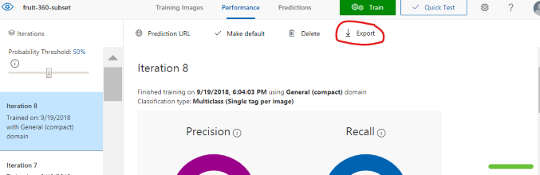
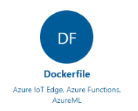
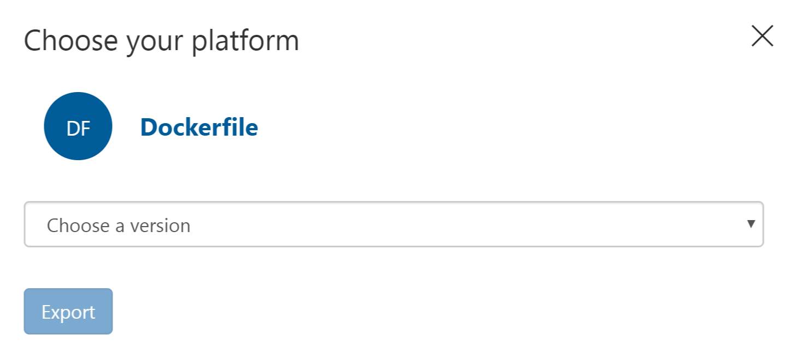
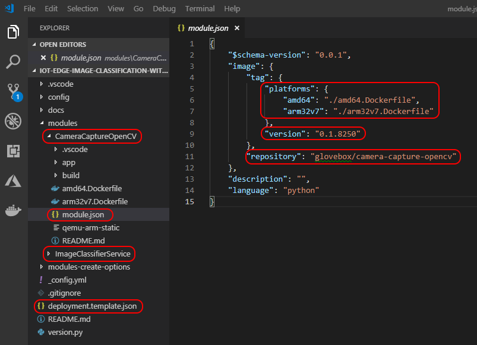
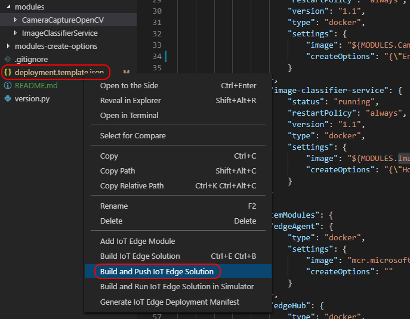
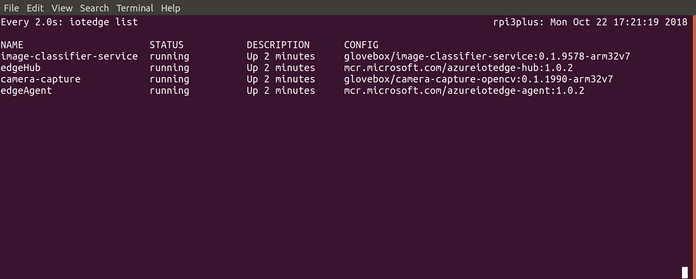

|Author|[Dave Glover](https://developer.microsoft.com/en-us/advocates/dave-glover), Microsoft Cloud Developer Advocate |
|----|---|
|Solution| [Creating an image recognition solution with Azure IoT Edge and Azure Cognitive Services](https://github.com/gloveboxes/Creating-an-image-recognition-solution-with-Azure-IoT-Edge-and-Azure-Cognitive-Services)|
|Documentation|[README](https://gloveboxes.github.io/Creating-an-image-recognition-solution-with-Azure-IoT-Edge-and-Azure-Cognitive-Services/) |
|Platform| [Azure IoT Edge](https://docs.microsoft.com/en-us/azure/iot-edge/?WT.mc_id=hackster-article-dglover)|
|Documentation | [Azure IoT Edge](https://docs.microsoft.com/en-us/azure/iot-edge/?WT.mc_id=hackster-article-dglover), [Azure Custom Vision](https://docs.microsoft.com/en-us/azure/cognitive-services/custom-vision-service/getting-started-build-a-classifier/?WT.mc_id=hackster-article-dglover), [Azure Speech Services](https://docs.microsoft.com/en-us/azure/cognitive-services/speech-service/overview/?WT.mc_id=hackster-article-dglover),  [Azure Functions on Edge](https://docs.microsoft.com/en-us/azure/iot-edge/tutorial-deploy-function/?WT.mc_id=hackster-article-dglover), [Azure Stream Analytics](https://docs.microsoft.com/en-us/azure/iot-edge/tutorial-deploy-stream-analytics/?WT.mc_id=hackster-article-dglover), [Azure Machine Learning Services](https://docs.microsoft.com/en-us/azure/iot-edge/tutorial-deploy-machine-learning/?WT.mc_id=hackster-article-dglover) |
|Video Training|[Enable edge intelligence with Azure IoT Edge](https://channel9.msdn.com/events/Connect/2017/T253)|
|Date|As at Oct 2018|

<!-- TOC -->

- [1. Image Classification with Azure IoT Edge](#1-image-classification-with-azure-iot-edge)
    - [1.1. Solution Overview](#11-solution-overview)
- [2. What is Azure IoT Edge?](#2-what-is-azure-iot-edge)
    - [2.1. Azure IoT Edge in Action](#21-azure-iot-edge-in-action)
    - [2.2. Solution Architectural Considerations](#22-solution-architectural-considerations)
- [3. Azure Services](#3-azure-services)
    - [3.1. Creating the Fruit Classification Model](#31-creating-the-fruit-classification-model)
    - [3.2. Exporting an Azure Custom Vision Model](#32-exporting-an-azure-custom-vision-model)
    - [3.3. Azure Speech Services](#33-azure-speech-services)
- [4. How to install, build and deploy the solution](#4-how-to-install-build-and-deploy-the-solution)
    - [4.1. Understanding the Project Structure](#41-understanding-the-project-structure)
    - [4.2. Building the Solution](#42-building-the-solution)
    - [4.3. Deploying the Solution](#43-deploying-the-solution)
    - [4.4. Monitoring the Solution on the IoT Edge Device](#44-monitoring-the-solution-on-the-iot-edge-device)
    - [4.5. Monitoring the Solution from the Azure IoT Edge Blade](#45-monitoring-the-solution-from-the-azure-iot-edge-blade)
- [5. Done!](#5-done)

<!-- /TOC -->

# 1. Image Classification with Azure IoT Edge

There are lots of applications for image recognition but what I had in mind when developing this application was a solution for vision impaired people scanning fruit and vegetables at a self-service check out.

## 1.1. Solution Overview

The system identifies the item scanned against a pre-trained machine learning model, tells the person what they have just scanned, then sends a record of the transaction to a central inventory system.

The solution runs on [Azure IoT Edge](#What is Azure IoT Edge?) and consists of a number of services.

1. The **Camera Capture Module** handles scanning items using a camera. It then calls the Image Classification module to identify the item, a call is then made to the "Text to Speech" module to convert item label to speech, and the name of the item scanned is played on the attached speaker.  

2. The **Image Classification Module** runs a Tensorflow machine learning model that has been trained with images of fruit. It handles classifying the scanned items.

3. The **Text to Speech Module** converts the name of the item scanned from text to speech using Azure Speech Services.

4. A USB Camera is used to capture images of items to be bought.

5. A Speaker for text to speech playback.

6. **Azure IoT Hub** (Free tier) is used for managing, deploying, and reporting Azure IoT Edge devices running the solution.

7. **Azure Speech Services** (free tier) is used to generate very natural speech telling the shopper what they have just scanned.

8. **Azure Custom Vision service** was used to build the fruit model used for image classification.


# 2. What is Azure IoT Edge?

The solution is built on [Azure IoT Edge](https://docs.microsoft.com/en-us/azure/iot-edge/?WT.mc_id=hackster-article-dglover) which is part of the Azure IoT Hub service and is used to define, secure and deploy a solution to an edge device. It also provides cloud-based central monitoring and reporting of the edge device.

The main components for an IoT Edge solution are:-

1. The [IoT Edge Runtime](https://docs.microsoft.com/en-us/azure/iot-edge/iot-edge-runtime/?WT.mc_id=hackster-article-dglover) which is installed on the local edge device and consists of two main components. The **IoT Edge "hub"**, responsible for communications, and the **IoT Edge "agent"**, responsible for running and monitoring modules on the edge device.

2. [Modules](https://docs.microsoft.com/en-us/azure/iot-edge/iot-edge-modules/?WT.mc_id=hackster-article-dglover). Modules are the unit of deployment. Modules are docker images pulled from a registry such as the [Azure Container Registry](https://azure.microsoft.com/en-au/services/container-registry/), or [Docker Hub](https://hub.docker.com/). Modules can be custom developed, built as [Azure Functions](https://docs.microsoft.com/en-us/azure/iot-edge/tutorial-deploy-function/?WT.mc_id=hackster-article-dglover), or as exported services from [Azure Custom Vision](https://docs.microsoft.com/en-us/azure/iot-edge/tutorial-deploy-stream-analytics/?WT.mc_id=hackster-article-dglover), [Azure Machine Learning](https://docs.microsoft.com/en-us/azure/iot-edge/tutorial-deploy-machine-learning/?WT.mc_id=hackster-article-dglover), or [Azure Stream Analytics](https://docs.microsoft.com/en-us/azure/iot-edge/tutorial-deploy-stream-analytics/?WT.mc_id=hackster-article-dglover).

3. Routes. Routes define message paths between modules and with Azure IoT Hub.

4. Properties. You can set "desired" properties for a module from Azure IoT Hub. For example, you might want to set a threshold property for a temperature alert.

5. Create Options. Create Options tell the Docker runtime what options to start the module with. For example, you may wish to open ports for REST APIs or debugging ports, define paths to devices such as a USB Camera, set environment variables, or enable privilege mode for certain hardware operations. For more information see the [Docker API](https://docs.docker.com/engine/api/latest/) documentation.

6. [Deployment Manifest](https://docs.microsoft.com/en-us/azure/iot-edge/module-composition/?WT.mc_id=hackster-article-dglover). The Deployment Manifest pulls everything together and tells the Azure IoT Edge runtime what modules to deploy, from where, plus what message routes to set up, and what create options to start each module with.

## 2.1. Azure IoT Edge in Action


## 2.2. Solution Architectural Considerations

So, with that overview of Azure IoT Edge here were my considerations and constraints for the solution.

1. The solution should scale from a Raspberry Pi (running Raspbian Linux) on ARM32v7, to my desktop development environment, to an industrial capable IoT Edge device such as those found in the [Certified IoT Edge Catalog](https://catalog.azureiotsolutions.com/).

2. The solution needs camera input, I used a USB Webcam for image capture as it was supported across all target devices.

3. The camera capture module needed Docker USB device pass-through (not supported by Docker on Windows) so that plus targeting Raspberry Pi meant that I need to target Azure IoT Edge on Linux.

4. I wanted my developer experience to mirror the devices I was targeting plus I needed Docker support for the USB webcam, so I developed the solution on my Ubuntu 18.04 developer desktop. See my [Ubuntu for Azure Developers](https://gloveboxes.github.io/Ubuntu-for-Azure-Developers/) guide.

    - As a workaround, if your development device is locked to Windows then use Ubuntu in Virtual Box which allows USB device pass-through which you can then pass-through to Docker in the Virtual Machine. A bit convoluted but it does work.


# 3. Azure Services

## 3.1. Creating the Fruit Classification Model

The [Azure Custom Vision](https://customvision.ai/) service is a simple way to create an image classification machine learning model without having to be a data science or machine learning expert. You simply upload multiple collections of labelled images. For example, you could upload a collection of banana images and label them as 'banana'.

To create your own classification model read [How to build a classifier with Custom Vision](https://docs.microsoft.com/en-us/azure/cognitive-services/custom-vision-service/getting-started-build-a-classifier/?WT.mc_id=hackster-article-dglover) for more information. It is important to have a good variety of labelled images so be sure to read [How to improve your classifier](https://docs.microsoft.com/en-us/azure/cognitive-services/custom-vision-service/getting-started-improving-your-classifier/?WT.mc_id=hackster-article-dglover).

## 3.2. Exporting an Azure Custom Vision Model

This "Image Classification" module includes a simple fruit classification model that was exported from Azure Custom Vision. For more information read how to [Export your model for use with mobile devices](https://docs.microsoft.com/en-us/azure/cognitive-services/custom-vision-service/export-your-model/?WT.mc_id=hackster-article-dglover). It is important to select one of the "**compact**" domains from the project settings page otherwise you will not be able to export the model.

Follow these steps to export your Custom Vision project model.

1. From the **Performance** tab of your Custom Vision project click **Export**.

    

2. Select Dockerfile from the list of available options

    

3. Then select the Linux version of the Dockerfile.

   

4. Download the docker file and unzip and you have a ready-made Docker solution with a Python Flask REST API. This was how I created the Azure IoT Edge Image Classification module in this solution. Too easy:)

## 3.3. Azure Speech Services

[Azure Speech services](https://azure.microsoft.com/en-au/services/cognitive-services/speech-services/) supports both "speech to text" and "text to speech". For this solution, I'm using the text to speech (F0) free tier which is limited to 5 million characters per month. You will need to add the Speech service using the Azure Portal and "Grab your key" from the service.


Open the deployment.template.json file and update the BingKey with the key you copied from the Azure Speech service.


# 4. How to install, build and deploy the solution

1. Clone this GitHub

   ```bash
    git clone https://github.com/gloveboxes/Azure-IoT-Edge-Custom-Vision-Image-Classification-with-Speech.git
   ```

2. Install the Azure IoT Edge runtime on your Linux desktop or device (eg Raspberry Pi).

    Follow the instructions to [Deploy your first IoT Edge module to a Linux x64 device](https://docs.microsoft.com/en-us/azure/iot-edge/quickstart-linux/?WT.mc_id=hackster-article-dglover).

3. Install the following software development tools.

    1. [Visual Studio Code](https://code.visualstudio.com/)
    2. Plus, the following Visual Studio Code Extensions
        - [Azure IoT Edge](https://marketplace.visualstudio.com/items?itemName=vsciot-vscode.azure-iot-edge)
        - [JSON Tools](https://marketplace.visualstudio.com/items?itemName=eriklynd.json-tools) useful for changing the "Create Options" for a module.
    3. [Docker Community Edition](https://docs.docker.com/install/) on your development machine

4. With Visual Studio Code, open the IoT Edge solution you cloned from GitHub to your developer desktop.

## 4.1. Understanding the Project Structure

The following describes the highlighted sections of the project.

1. There are two modules: CameraCaptureOpenCV and ImageClassifierService.

2. The module.json file defines the Docker build process, the module version, and your docker registry. Updating the version number, pushing the updated module to an image registry, and updating the deployment manifest for an edge device triggers the Azure IoT Edge runtime to pull down the new module to the edge device.

3. The deployment.template.json file is used by the build process. It defines what modules to build, what message routes to set up, and what version of the IoT Edge runtime to run.

4. The deployment.json file is generated from the deployment.template.json and is the [Deployment Manifest](https://docs.microsoft.com/en-us/azure/iot-edge/module-composition/?WT.mc_id=hackster-article-dglover)

5. The version.py in the project root folder is a helper app you can run on your development machine that updates the version number of each module. Useful as a change in the version number is what triggers Azure IoT Edge runtime to pull the updated module and it is easy to forget to change the module version numbers:)



## 4.2. Building the Solution

You need to ensure the image you plan to build matches the target processor architecture specified in the deployment.template.json file.

1. Specify your Docker repository in the module.json file for each module. For development and testing, it is faster to push images to a local docker registry
2. Setup a local Docker registry for prototyping and testing purposes. It will significantly speed up the development, deployment and test cycles.

    ```bash
    docker run -d -p 5000:5000 --restart always --name registry registry:2
    ```
3. If pushing the image to a local Docker repository the specify localhost:5000. 
    ```json
    "repository": "localhost:5000/camera-capture-opencv"
    ```
4. Confirm processor architecture you plan to build for.
    1. Open the **deployment.template.json** file
    2. Under settings for each module there is an image property that ends with **amd64**. This maps to the Platforms collecting in the **module.json** file for each module, which in turn maps to the Dockerfile to use for the build process. So leave as **amd64** or change to **arm32v7** depending on the platform you are targeting.

    ```json
    "image": "${MODULES.ImageClassifierService.amd64}"
    ```
5. If you plan to target Raspberry Pi 2, 3, or 3+ and you are developing on Linux you will need to enable cross compiling from Intel to arm32v7. After installing Docker run the following command. See [How to Build ARM Docker Images on Intel host](http://www.hotblackrobotics.com/en/blog/2018/01/22/docker-images-arm/) for more details.
    ```bash
    docker run --rm --privileged multiarch/qemu-user-static:register --reset
    ```
6. Next, Build and Push the solution to Docker by right mouse clicking the deployment.template.json file and select "**Build and Push IoT Edge Solution**". The first build will be slow as Docker needs to pull the base layers to your local machine. If you are cross compiling to arm32v7 then the first build will be very slow as OpenCV and Python requirements need to be compiled. On a fast Intel i7-8750H processor cross compiling this solution will take approximately 40 minutes.

    

## 4.3. Deploying the Solution

When the Docker Build and Push process has completed select the Azure IoT Hub device you want to deploy the solution to. Right mouse click the deployment.json file found in the config folder and select the target device from the drop-down list.

   

## 4.4. Monitoring the Solution on the IoT Edge Device

Once the solution has been deployed you can monitor it on the IoT Edge device itself using the ```iotedge list``` command.

```bash
iotedge list
```

   

## 4.5. Monitoring the Solution from the Azure IoT Edge Blade

You can monitor the state of the Azure IoT Edge module from the Azure IoT Hub blade on the [Azure Portal](http://portal.azure.com).

   

   Click on the device from the Azure IoT Edge blade to view more details about the modules  running on the device.

   

# 5. Done!

When the solution is finally deployed to the IoT Edge device the system will start telling you what items it thinks have been scanned.

Congratulations you have deployed your first Azure IoT Edge Solution!


